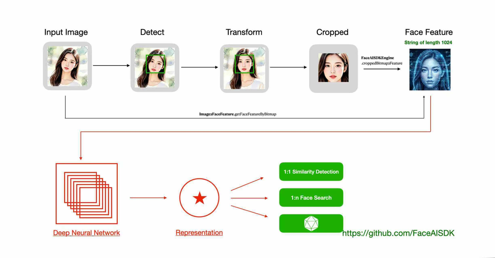
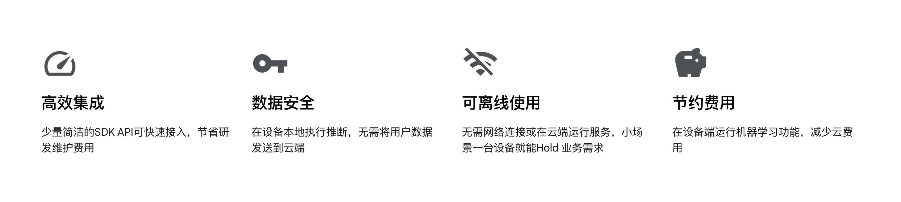

 
 
  

# [关于「FaceAISDK」](https://github.com/FaceAISDK/FaceAISDK_Android)

FaceAISDK is on_device Offline Face Detection 、Recognition 、Liveness Detection Anti Spoofing and 1:N/M:N Face Search SDK  
FaceAISDK包括人脸识别、活体检测、人脸录入检测以及[1：N以及M：N](https://github.com/FaceAISDK/FaceAISDK_Android/blob/main/Introduce_11_1N_MN.md) 人脸搜索，可完全离线实现端侧人脸识别，人脸搜索等功能。

Android SDK可支持Android[7,16] **SDK所有功能都不用联网，不保存不上传任何人脸信息敏感资料更具隐私安全**
动作活体支持张嘴、微笑、眨眼、摇头、点头 随机1-2种组合验证，支持系统和UVC协议USB摄像头，需成像清晰抗逆光宽动态值>105Db。
开发人员也可以自定义摄像头管理，把帧数据送入到SDK。更多说明联系邮箱： FaceAISDK.Service@gmail.com

##  V2026.03.18(大更新) 强烈建议用户更新
- Google Play 上架安全认证审核
- 解决部分机型可能闪退的问题
- 提高成像不清晰摄像头识别精确度
- 远距离小图片识别精度提升
- 动作活体灵敏度提升
- 低配设备12小时连续运行稳定性
- 人脸搜索添加静默活体Beta版本
- 提升M：N人脸搜索精度，提升对齐效率
- 1:1 人脸识别防止真假人脸作弊
- 32位CPU定制Android设备人脸录入识别适配

更多SDK升级记录：https://github.com/FaceAISDK/FaceAISDK_Android/blob/publish/doc/%E5%8E%86%E5%8F%B2%E7%89%88%E6%9C%ACSDK%E6%9B%B4%E6%96%B0%E8%AE%B0%E5%BD%95.md

## 接入集成使用
  更新GitHub 最新的代码，花1天左右时间熟悉SDK API 和对应的注释备注，断点调试一下基本功能；熟悉后再接入到主工程   
  欲速则不达，一定要先跑成功SDK接入示范Demo,熟悉后再接入到主工程验证匹配业务功能；有问题可以GitHub 提issues

*   1.调整JDK版本到java 17。AS设置Preferences -> Build -> Gradle -> JDK的版本为 17

*   2.升级Android Studio到2025.2.2(可选，内置Gemini3 AI辅助开发),升级AGP到8.13，同步Demo工程中的其他依赖

*   3.Demo工程成功运行后，根据你的业务需求重点熟悉对应模块后再集成到你的主工程

*   4.**集成到你的主工程**，首先Gradle 中引入依赖
    implementation 'io.github.FaceAISDK:Android:版本号' //及时升级到github最新版

*   5.解决项目工程中的第三方依赖库和主工程的冲突比如CameraX的版本等，Target SDK不同导致的冲突

    目前SDK Demo默认使用**Android Studio2025.1.4 + java17 + kotlin1.9.22 + AGP8.13 打包  
    不建议再使用废弃的kapt, kotlin-android-extensions  
    注：为了Debug View Bitmap以及更好的使用AI 辅助编程开发,2025年10月31号我们对开发环境升级到上述版本 

**工程目录结构简要介绍**

| 模块           | 描述                                           |
|---------------|----------------------------------------------|
| Demo          | Demo主工程，implementation project(':faceAILib') |
| faceAILib     | 子Module，FaceAISDK 所有功能都在module 中演示           |
| /verify/\*    | 1:1 人脸检测识别，活体检测页面，静态人脸对比                     |
| /search/\*    | 1:N 人脸搜索识别，人脸库增删改管理等财政                       |
| /addFaceImage | 人脸识别和搜索共用的通过SDK相机添加人脸获取人脸特征值                 |
| /SysCamera/\* | 手机，平板自带的系统相机，一般系统摄像头打开就能看效果                  |
| /UVCCamera/\* | UVC协议USB摄像头人脸识别，人脸搜索，一般是自自定义的硬件              |

更多历史版本说明参考 [历史版本SDK更新记录](doc/历史版本SDK更新记录.md)

## [使用场景和区别](https://github.com/FaceAISDK/FaceAISDK_Android/blob/main/doc/Introduce_11_1N_MN.md)

【1:1】 移动考勤签到、App免密登录、刷脸授权、刷脸解锁、巡更打卡真人校验

【1:N】 小区门禁、公司门禁、智能门锁、智慧校园、机器人、智能家居、社区、酒店等

【M:N】 公安布控、人群追踪 监控等 (测试效果可使用images/MN_face_search_test.jpg 模拟)

**其他平台**  
**iOS SDK：** https://github.com/FaceAISDK/FaceAISDK_iOS  
**Android：** https://github.com/FaceAISDK/FaceAISDK_Android

**其他实现**  
**uniApp UTS插件：**  https://github.com/FaceAISDK/FaceAISDK_uniapp_UTS   
**uniApp 人脸搜索：**  https://github.com/FaceAISDK/FaceSearch_uniapp_plugin  
**React native：** https://github.com/zkteco-home/react-native-face-ai  

## Demo APK 下载体验  

 **都看到这了，顺手帮忙点个🌟Star吧**  
🪐

[更多说明，请参考：FaceAISDK产品说明及API文档](FaceAISDK产品说明及API文档.pdf)